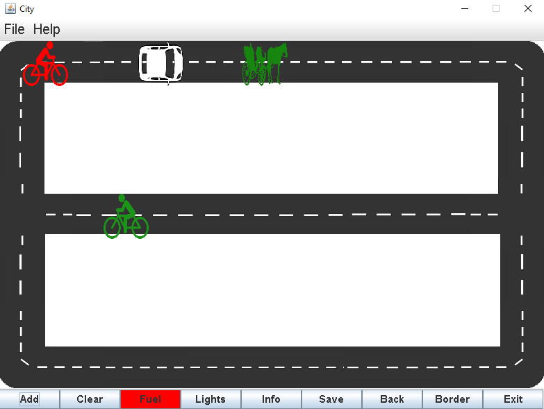

# vehicles-game

During the second year of studying software engineering,
I built a vehicle game that allows you to select vehicles and transport them on the screen.

<u>game rules:</u>
When the vehicles collides - the vehicle that collided with it is deleted.
All vehicles except bike stop until you enter a "fuel" button.
When the vehicle reaches one of the middle corners the game randomly decides where it will continue.

I used design patterns like: 
Singleton, Memento, Factory Method 

 
